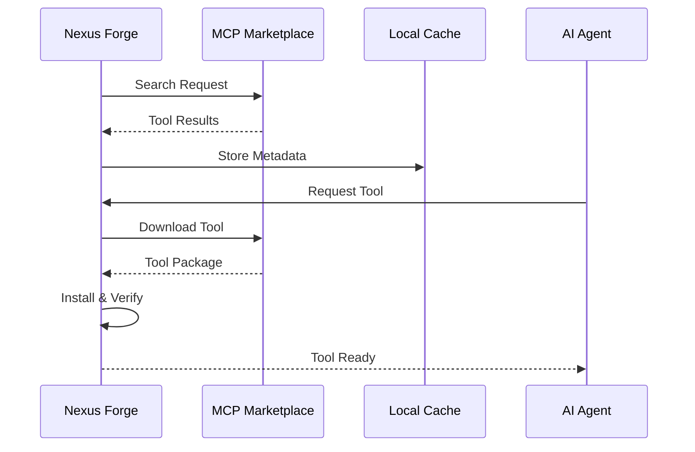

# 🛒 ADK Marketplace Integration Technical Specification

## Overview

This specification details the integration of Nexus Forge with the ADK marketplace ecosystem, enabling dynamic tool discovery, agent distribution, and community-driven expansion.

## 1. MCP Marketplace Integration

### 1.1 Architecture Overview

```python
from typing import Dict, List, Optional
from dataclasses import dataclass

@dataclass
class MCPTool:
    """MCP Tool representation"""
    id: str
    name: str
    version: str
    description: str
    capabilities: List[str]
    requirements: Dict[str, str]
    author: str
    rating: float
    downloads: int
    verified: bool

class MCPMarketplaceClient:
    """Client for interacting with MCP marketplace"""
    
    def __init__(self, api_key: str, base_url: str = "https://mcp.adk.google.com"):
        self.api_key = api_key
        self.base_url = base_url
        self.cache = ToolCache()
        self.installer = ToolInstaller()
    
    async def search_tools(self, query: str, filters: Dict = None) -> List[MCPTool]:
        """Search for tools in the marketplace"""
        # Implementation details
        pass
    
    async def install_tool(self, tool_id: str, version: str = "latest") -> bool:
        """One-click tool installation"""
        # Download verification
        # Dependency resolution
        # Sandbox installation
        # Integration setup
        pass
```

### 1.2 Tool Discovery Protocol

**Discovery Flow:**



### 1.3 Dynamic Tool Loading

```python
class DynamicToolLoader:
    """Runtime tool loading system"""
    
    def __init__(self):
        self.loaded_tools: Dict[str, MCPTool] = {}
        self.sandbox = ToolSandbox()
        self.verifier = SecurityVerifier()
    
    async def load_tool(self, tool_spec: MCPTool) -> Optional[callable]:
        """Dynamically load and initialize tool"""
        
        # Security verification
        if not await self.verifier.verify_signature(tool_spec):
            raise SecurityException("Tool signature verification failed")
        
        # Sandbox execution
        tool_instance = await self.sandbox.initialize(tool_spec)
        
        # Capability registration
        await self.register_capabilities(tool_spec.id, tool_spec.capabilities)
        
        # Hot reload support
        self.loaded_tools[tool_spec.id] = tool_instance
        
        return tool_instance
```

## 2. Agent Marketplace

### 2.1 Agent Distribution System

```python
@dataclass
class MarketplaceAgent:
    """Marketplace agent specification"""
    id: str
    name: str
    type: str  # researcher, coder, analyzer, etc.
    framework: str  # adk, langchain, crewai, etc.
    capabilities: List[str]
    model_requirements: Dict[str, Any]
    performance_metrics: Dict[str, float]
    price_tier: str  # free, pro, enterprise
    
class AgentMarketplace:
    """Agent distribution and discovery system"""
    
    async def publish_agent(self, agent: MarketplaceAgent, package: bytes) -> str:
        """Publish agent to marketplace"""
        # Package validation
        # Capability indexing
        # Performance benchmarking
        # Marketplace listing
        pass
    
    async def discover_agents(self, requirements: Dict) -> List[MarketplaceAgent]:
        """Discover agents based on requirements"""
        # Capability matching
        # Performance filtering
        # Cost optimization
        # Compatibility checking
        pass
```

### 2.2 Agent Packaging Format

```yaml
# agent-manifest.yaml
metadata:
  id: "nexus-forge-researcher-v2"
  name: "Advanced Research Agent"
  version: "2.0.0"
  author: "Nexus Forge Team"
  license: "MIT"

capabilities:
  - web_search
  - paper_analysis
  - data_extraction
  - report_generation

requirements:
  models:
    - gemini-2.5-flash-thinking
    - text-embedding-3-large
  memory: 4GB
  compute: 2vCPU
  
performance:
  avg_response_time: 2.5s
  accuracy_score: 0.94
  cost_per_task: 0.02

integration:
  protocols:
    - agent2agent-v2
    - langchain-v1
    - adk-native
  
deployment:
  container: gcr.io/nexus-forge/researcher:2.0.0
  health_check: /health
  metrics_endpoint: /metrics
```

### 2.3 Community Contribution System

```python
class CommunityHub:
    """Community-driven agent and tool sharing"""
    
    def __init__(self):
        self.review_system = PeerReviewSystem()
        self.rating_engine = RatingEngine()
        self.reward_system = ContributorRewards()
    
    async def submit_contribution(self, contribution: Union[MCPTool, MarketplaceAgent]):
        """Submit community contribution"""
        # Automated testing
        # Security scanning
        # Peer review process
        # Quality scoring
        # Reward distribution
```

## 3. Integration Architecture

### 3.1 Marketplace Gateway

```python
class MarketplaceGateway:
    """Central gateway for all marketplace interactions"""
    
    def __init__(self):
        self.mcp_client = MCPMarketplaceClient()
        self.agent_marketplace = AgentMarketplace()
        self.community_hub = CommunityHub()
        self.cache_manager = MarketplaceCacheManager()
        self.security_scanner = SecurityScanner()
    
    async def search_all(self, query: str) -> Dict[str, List]:
        """Unified search across all marketplaces"""
        results = {
            "tools": await self.mcp_client.search_tools(query),
            "agents": await self.agent_marketplace.discover_agents({"query": query}),
            "community": await self.community_hub.search_contributions(query)
        }
        return results
```

### 3.2 Installation Pipeline

```python
class InstallationPipeline:
    """Automated installation and setup pipeline"""
    
    stages = [
        "download",
        "verify",
        "extract",
        "dependencies",
        "configure",
        "test",
        "integrate",
        "activate"
    ]
    
    async def install(self, package_id: str, package_type: str):
        """Execute installation pipeline"""
        for stage in self.stages:
            try:
                await self.execute_stage(stage, package_id, package_type)
            except StageException as e:
                await self.rollback(stage, package_id)
                raise InstallationException(f"Failed at stage: {stage}")
```

### 3.3 Dependency Resolution

```python
class DependencyResolver:
    """Smart dependency resolution system"""
    
    def __init__(self):
        self.dependency_graph = DependencyGraph()
        self.conflict_resolver = ConflictResolver()
        self.version_manager = VersionManager()
    
    async def resolve(self, package: Dict) -> List[Dict]:
        """Resolve all dependencies"""
        # Build dependency tree
        tree = await self.dependency_graph.build(package)
        
        # Detect conflicts
        conflicts = await self.conflict_resolver.detect(tree)
        
        # Resolve conflicts
        if conflicts:
            resolution = await self.conflict_resolver.resolve(conflicts)
            tree = await self.apply_resolution(tree, resolution)
        
        # Order by installation sequence
        return self.topological_sort(tree)
```

## 4. Runtime Integration

### 4.1 Hot Reload System

```python
class HotReloadManager:
    """Enable hot reloading of tools and agents"""
    
    def __init__(self):
        self.file_watcher = FileWatcher()
        self.reload_queue = asyncio.Queue()
        self.active_instances = {}
    
    async def watch_and_reload(self):
        """Monitor and reload changed components"""
        async for change in self.file_watcher.watch():
            if change.type in ["tool", "agent"]:
                await self.reload_queue.put(change)
                await self.reload_component(change)
```

### 4.2 Performance Optimization

```python
class MarketplaceOptimizer:
    """Optimize marketplace operations"""
    
    def __init__(self):
        self.cache = DistributedCache()
        self.cdn = CDNIntegration()
        self.predictor = UsagePredictor()
    
    async def optimize_downloads(self):
        """Pre-download popular tools"""
        popular = await self.predictor.predict_popular()
        for tool in popular:
            await self.cdn.pre_cache(tool)
    
    async def optimize_search(self):
        """Index and cache search results"""
        # Elasticsearch integration
        # Result caching
        # Query optimization
```

## 5. Security Framework

### 5.1 Verification System

```python
class SecurityFramework:
    """Comprehensive security for marketplace integrations"""
    
    def __init__(self):
        self.signature_verifier = SignatureVerifier()
        self.sandbox_executor = SandboxExecutor()
        self.vulnerability_scanner = VulnerabilityScanner()
        self.permission_manager = PermissionManager()
    
    async def verify_package(self, package: bytes, metadata: Dict) -> bool:
        """Multi-layer security verification"""
        # Signature verification
        if not await self.signature_verifier.verify(package, metadata["signature"]):
            return False
        
        # Vulnerability scanning
        vulnerabilities = await self.vulnerability_scanner.scan(package)
        if vulnerabilities.critical > 0:
            return False
        
        # Sandbox testing
        sandbox_result = await self.sandbox_executor.test(package)
        
        return sandbox_result.safe
```

### 5.2 Permission Management

```yaml
# permission-manifest.yaml
tool_permissions:
  filesystem:
    read: ["/data", "/config"]
    write: ["/tmp", "/output"]
  network:
    allowed_hosts: ["*.google.com", "api.openai.com"]
    blocked_ports: [22, 3389]
  system:
    max_memory: 2GB
    max_cpu: 50%
    max_threads: 10
```

## 6. Monitoring and Analytics

### 6.1 Usage Analytics

```python
class MarketplaceAnalytics:
    """Track marketplace usage and performance"""
    
    def __init__(self):
        self.metrics_collector = MetricsCollector()
        self.usage_tracker = UsageTracker()
        self.performance_monitor = PerformanceMonitor()
    
    async def track_installation(self, package_id: str, user_id: str):
        """Track tool/agent installations"""
        await self.usage_tracker.record({
            "event": "installation",
            "package_id": package_id,
            "user_id": user_id,
            "timestamp": datetime.now(),
            "success": True
        })
    
    async def generate_insights(self) -> Dict:
        """Generate marketplace insights"""
        return {
            "popular_tools": await self.get_trending_tools(),
            "performance_metrics": await self.get_performance_stats(),
            "user_patterns": await self.analyze_usage_patterns()
        }
```

### 6.2 Quality Metrics

```python
class QualityMetrics:
    """Track and ensure marketplace quality"""
    
    metrics = {
        "installation_success_rate": 0.99,
        "average_install_time": 15.0,  # seconds
        "tool_availability": 0.999,
        "search_response_time": 0.5,  # seconds
        "user_satisfaction": 4.8  # out of 5
    }
```

## 7. API Specifications

### 7.1 REST API

```yaml
openapi: 3.0.0
info:
  title: Nexus Forge Marketplace API
  version: 1.0.0

paths:
  /marketplace/search:
    get:
      parameters:
        - name: query
          in: query
          required: true
        - name: type
          in: query
          enum: [tool, agent, all]
        - name: filters
          in: query
          type: object
      responses:
        200:
          description: Search results
          
  /marketplace/install:
    post:
      requestBody:
        content:
          application/json:
            schema:
              type: object
              properties:
                package_id: string
                version: string
                options: object
      responses:
        200:
          description: Installation successful
```

### 7.2 WebSocket API

```python
class MarketplaceWebSocket:
    """Real-time marketplace updates"""
    
    async def subscribe_updates(self, filters: Dict):
        """Subscribe to marketplace updates"""
        # New tool notifications
        # Version updates
        # Community contributions
        # Rating changes
```

## 8. Integration Examples

### 8.1 Tool Integration

```python
# Example: Integrating a web scraping tool
async def integrate_web_scraper():
    # Search marketplace
    tools = await marketplace.search_tools("web scraper")
    
    # Select best tool
    best_tool = select_by_rating(tools)
    
    # Install tool
    await marketplace.install_tool(best_tool.id)
    
    # Use in agent
    scraper = await load_tool("web-scraper-pro")
    results = await scraper.scrape("https://example.com")
```

### 8.2 Agent Integration

```python
# Example: Adding specialized research agent
async def add_research_agent():
    # Discover research agents
    agents = await marketplace.discover_agents({
        "type": "researcher",
        "capabilities": ["academic_search", "paper_analysis"]
    })
    
    # Install agent
    await marketplace.install_agent(agents[0].id)
    
    # Integrate with orchestrator
    researcher = await load_agent("academic-researcher-v3")
    await orchestrator.register_agent(researcher)
```

## 9. Future Roadmap

### 9.1 Phase 1: Core Integration (Days 1-2)
- Basic MCP marketplace connection
- Tool search and installation
- Agent discovery

### 9.2 Phase 2: Advanced Features (Days 3-4)
- Community hub
- Hot reload system
- Advanced security

### 9.3 Phase 3: Optimization (Days 5-7)
- Performance optimization
- Analytics dashboard
- Enterprise features

## 10. Success Metrics

- **Tool Installation Success Rate**: >99%
- **Average Discovery Time**: <500ms
- **Community Contributions**: >100 in first month
- **User Satisfaction**: >4.5/5
- **Security Incidents**: 0

---

This specification enables Nexus Forge to become a central hub for AI agent and tool distribution, showcasing deep ADK marketplace integration for the hackathon.