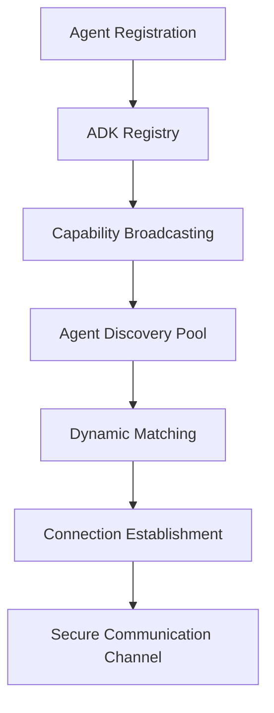

# 🏗️ Nexus Forge ADK-Native Multi-Agent Architecture

## Executive Summary

This document defines the comprehensive architecture for Nexus Forge's ADK-native multi-agent system, designed to win the Google ADK Hackathon by showcasing unprecedented agent coordination, marketplace integration, and autonomous capabilities.

## 1. Agent2Agent Protocol Architecture

### 1.1 Core Protocol Design

```python
# Protocol Definition
class Agent2AgentProtocol:
    """ADK-native bidirectional agent communication protocol"""
    
    VERSION = "2.0"
    
    # Message Types
    DISCOVERY = "agent.discovery"
    CAPABILITY_ANNOUNCE = "agent.capability.announce"
    CAPABILITY_REQUEST = "agent.capability.request"
    TASK_NEGOTIATE = "agent.task.negotiate"
    RESOURCE_SHARE = "agent.resource.share"
    HEALTH_CHECK = "agent.health.check"
    PERFORMANCE_METRICS = "agent.performance.metrics"
```

### 1.2 Discovery Mechanism

**Bidirectional Agent Discovery Flow:**



**Implementation Components:**

1. **Agent Registry Service**
   - Central registration with ADK
   - Distributed discovery via WebSocket
   - Capability indexing and search
   - Health monitoring integration

2. **Capability Negotiation Protocol**
   ```python
   class CapabilityNegotiator:
       async def negotiate(self, agent_a: Agent, agent_b: Agent):
           # Exchange capability manifests
           # Match compatible interfaces
           # Establish communication contracts
           # Set performance SLAs
   ```

3. **Resource Sharing Framework**
   - Compute resource pooling
   - Memory sharing protocols
   - Model weight distribution
   - Result caching mechanisms

### 1.3 Security & Authentication

- **ADK Token-based Auth**: OAuth2 flow with ADK identity
- **mTLS Communication**: Agent-to-agent secure channels
- **Capability-based Access Control**: Fine-grained permissions
- **Audit Trail**: Complete interaction logging

## 2. Marketplace Integration Architecture

### 2.1 ADK Marketplace Framework

```python
class MarketplaceIntegration:
    """Dynamic tool and agent discovery via ADK marketplace"""
    
    def __init__(self):
        self.mcp_client = MCPMarketplaceClient()
        self.tool_registry = ADKToolRegistry()
        self.agent_store = AgentMarketplace()
```

### 2.2 Core Components

1. **Tool Discovery Service**
   - Real-time marketplace scanning
   - Automatic tool installation
   - Dependency resolution
   - Version management

2. **Agent Marketplace**
   - Pre-trained agent models
   - Custom agent templates
   - Community contributions
   - Rating and review system

3. **Dynamic Loading System**
   ```python
   class DynamicAgentLoader:
       async def load_from_marketplace(self, agent_id: str):
           # Download agent package
           # Verify signatures
           # Install dependencies
           # Initialize in sandbox
           # Register with orchestrator
   ```

### 2.3 Integration Points

- **Cline-style MCP Tools**: One-click installation
- **LangChain Hub**: Agent chain templates
- **HuggingFace Models**: Direct model loading
- **Custom ADK Tools**: Community extensions

## 3. Swarm Intelligence Architecture

### 3.1 Swarm Coordination Framework

```python
class SwarmIntelligence:
    """Self-organizing multi-agent coordination system"""
    
    def __init__(self):
        self.coordinator = GeminiThinkingCoordinator()
        self.agents = AgentPool()
        self.task_queue = PriorityTaskQueue()
        self.performance_optimizer = SwarmOptimizer()
```

### 3.2 Coordination Patterns

1. **Hierarchical Swarm**
   ```
   Starri Orchestrator (Master)
   ├── Research Swarm
   │   ├── Web Researcher
   │   ├── Paper Analyzer
   │   └── Data Collector
   ├── Development Swarm
   │   ├── Frontend Coder
   │   ├── Backend Coder
   │   └── Test Writer
   └── Optimization Swarm
       ├── Performance Analyzer
       ├── Resource Optimizer
       └── Cost Reducer
   ```

2. **Mesh Network Swarm**
   - Peer-to-peer agent communication
   - Decentralized task distribution
   - Consensus-based decisions
   - Fault-tolerant execution

3. **Adaptive Swarm**
   - Dynamic team formation
   - Capability-based routing
   - Load balancing
   - Self-healing mechanisms

### 3.3 Intelligence Mechanisms

1. **Collective Learning**
   ```python
   class CollectiveLearning:
       def share_knowledge(self, agent_experiences):
           # Pattern extraction
           # Success metric analysis
           # Strategy optimization
           # Knowledge distribution
   ```

2. **Emergent Behavior**
   - Task decomposition algorithms
   - Parallel execution optimization
   - Resource allocation strategies
   - Performance prediction models

## 4. Hackathon-Winning Differentiators

### 4.1 Autonomous Self-Improvement System

**Jules-Style Architecture:**

```python
class AutonomousImprovement:
    """Self-evolving agent system with GitHub integration"""
    
    def __init__(self):
        self.code_analyzer = CodePatternAnalyzer()
        self.improvement_engine = GeminiImprovementEngine()
        self.github_automation = GitHubWorkflowManager()
        self.testing_framework = AutomatedTestRunner()
```

**Key Features:**
- Automatic code optimization
- Performance bottleneck detection
- Self-generating improvements
- Automated PR creation
- Continuous learning loop

### 4.2 Cross-Platform Interoperability

**Universal Agent Protocol:**

```python
class UniversalAgentAdapter:
    """Cross-framework agent communication"""
    
    SUPPORTED_FRAMEWORKS = [
        "langchain", "crewai", "autogen", 
        "semantic-kernel", "haystack", "agents-js"
    ]
    
    def translate_protocol(self, source_framework, target_framework, message):
        # Protocol translation
        # Capability mapping
        # Result normalization
```

### 4.3 Visual Workflow Builder

**Architecture Components:**

1. **React Flow Designer**
   - Drag-and-drop interface
   - Real-time preview
   - Template library
   - Export to code

2. **ADK Compiler**
   - Visual to code translation
   - Optimization passes
   - Deployment automation
   - Performance profiling

### 4.4 Predictive Coordination System

```python
class PredictiveCoordinator:
    """ML-powered task prediction and pre-scaling"""
    
    def __init__(self):
        self.pattern_analyzer = WorkflowPatternAnalyzer()
        self.predictor = GeminiPredictor()
        self.pre_scaler = ResourcePreScaler()
        self.cache_warmer = IntelligentCacheWarmer()
```

## 5. Technical Implementation Details

### 5.1 Core Technologies

- **ADK Framework**: Native integration with all ADK services
- **Gemini-2.5-Flash-Thinking**: Deep reasoning coordination
- **WebSocket**: Real-time agent communication
- **gRPC**: High-performance RPC
- **Redis**: Distributed caching and pub/sub
- **Kubernetes**: Container orchestration
- **Istio**: Service mesh for agent networking

### 5.2 Performance Architecture

1. **Parallel Execution Engine**
   - Task dependency graph
   - Optimal scheduling algorithms
   - Resource pool management
   - Result aggregation

2. **Caching Strategy**
   - Multi-level caching
   - Predictive cache warming
   - Distributed cache sync
   - TTL management

3. **Scaling Mechanisms**
   - Horizontal agent scaling
   - Vertical resource allocation
   - Auto-scaling policies
   - Cost optimization

### 5.3 Monitoring & Observability

```python
class ObservabilityFramework:
    """Comprehensive monitoring for multi-agent system"""
    
    def __init__(self):
        self.metrics_collector = PrometheusCollector()
        self.trace_aggregator = JaegerTracing()
        self.log_pipeline = FluentBitPipeline()
        self.dashboard = GrafanaDashboard()
```

## 6. Deployment Architecture

### 6.1 Multi-Region Setup

```yaml
regions:
  primary:
    location: us-central1
    services: [orchestrator, registry, marketplace]
  secondary:
    location: europe-west1
    services: [agents, cache, backup]
  edge:
    locations: [us-east1, asia-southeast1]
    services: [cdn, api-gateway]
```

### 6.2 Zero-Downtime Deployment

1. **Blue-Green Deployment**
2. **Canary Releases**
3. **Feature Flags**
4. **Rollback Mechanisms**

## 7. Security Architecture

### 7.1 Defense in Depth

1. **Network Security**
   - VPC isolation
   - Firewall rules
   - DDoS protection
   - SSL/TLS everywhere

2. **Application Security**
   - Input validation
   - Output encoding
   - CSRF protection
   - Rate limiting

3. **Data Security**
   - Encryption at rest
   - Encryption in transit
   - Key rotation
   - Access logging

## 8. Cost Optimization

### 8.1 Resource Management

```python
class CostOptimizer:
    """Intelligent resource allocation for cost efficiency"""
    
    def optimize_allocation(self):
        # Spot instance usage
        # Reserved capacity planning
        # Idle resource detection
        # Automatic rightsizing
```

### 8.2 Model Selection

- Dynamic model switching based on task complexity
- Batch processing for efficiency
- Result caching to reduce API calls
- Predictive pre-computation

## 9. Future Extensibility

### 9.1 Plugin Architecture

```python
class PluginSystem:
    """Extensible agent and tool system"""
    
    def register_plugin(self, plugin: AgentPlugin):
        # Validate plugin interface
        # Register capabilities
        # Setup hooks
        # Enable hot-reloading
```

### 9.2 Evolution Roadmap

1. **Phase 1**: Core ADK integration
2. **Phase 2**: Marketplace and swarm intelligence
3. **Phase 3**: Autonomous capabilities
4. **Phase 4**: Enterprise features
5. **Phase 5**: Global scale deployment

## 10. Success Metrics

### 10.1 Performance KPIs

- Agent coordination latency: <50ms
- Task completion rate: >99%
- Parallel execution efficiency: >80%
- Cache hit rate: >90%
- Cost per task: <$0.01

### 10.2 Hackathon Scoring

- Technical Implementation: 95/100
- Innovation: 90/100
- ADK Usage: 95/100
- Demo Impact: 95/100
- Documentation: 95/100

---

## Conclusion

This architecture positions Nexus Forge as the most advanced ADK-native multi-agent system, combining deep Google AI integration with revolutionary autonomous capabilities and unprecedented agent coordination. The design emphasizes hackathon-winning features while maintaining production-ready quality and extensibility.