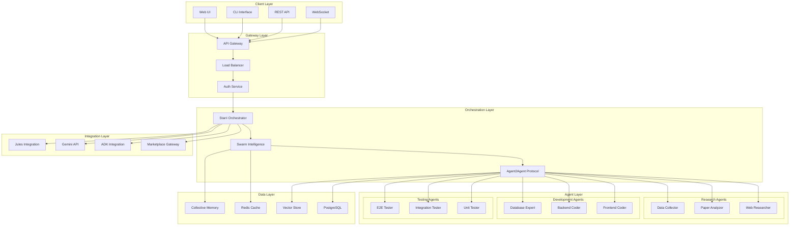
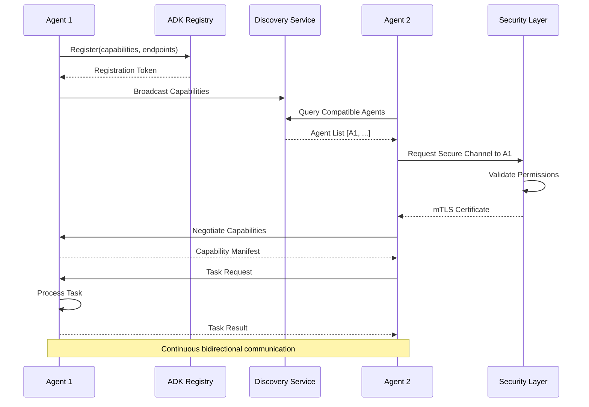
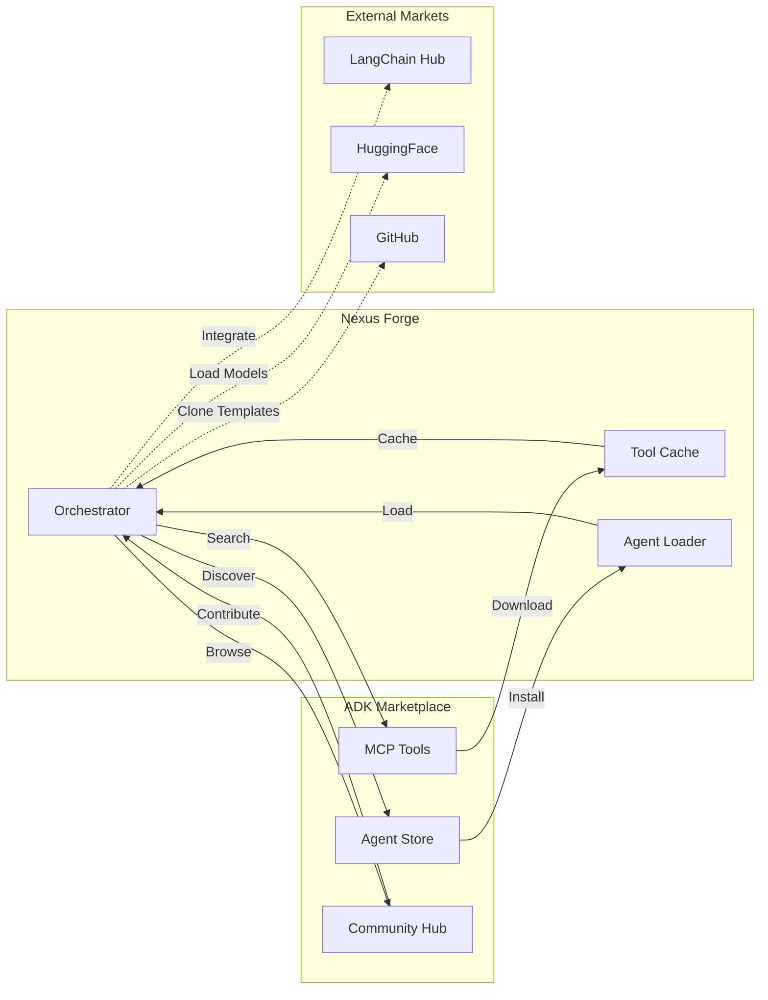
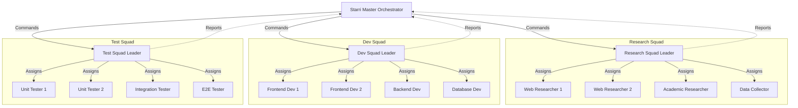
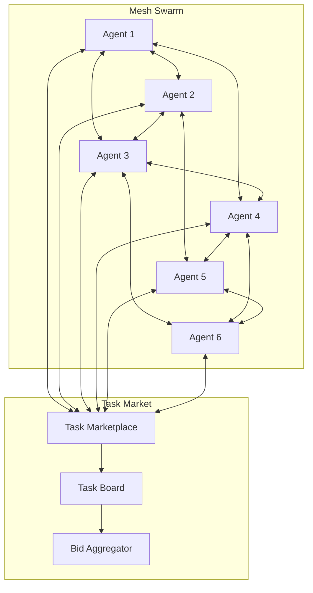
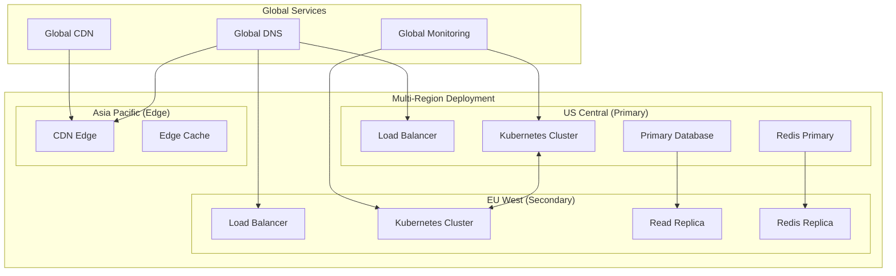
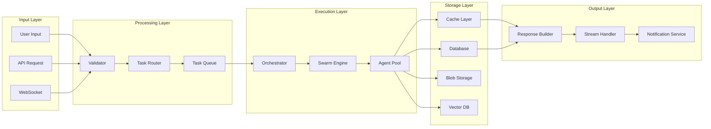
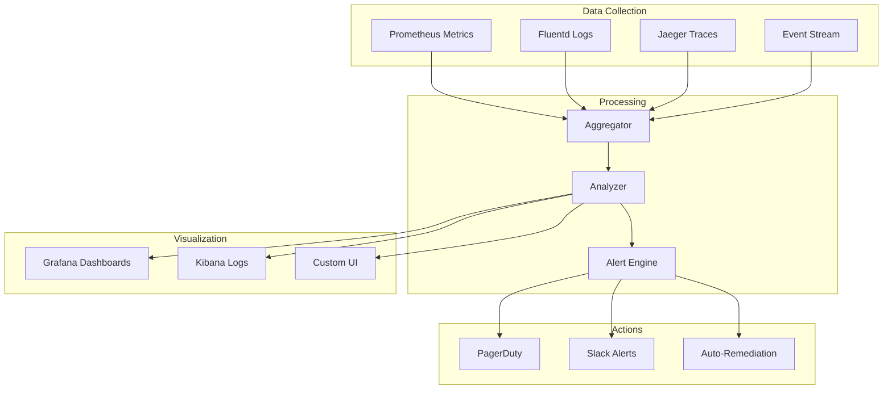
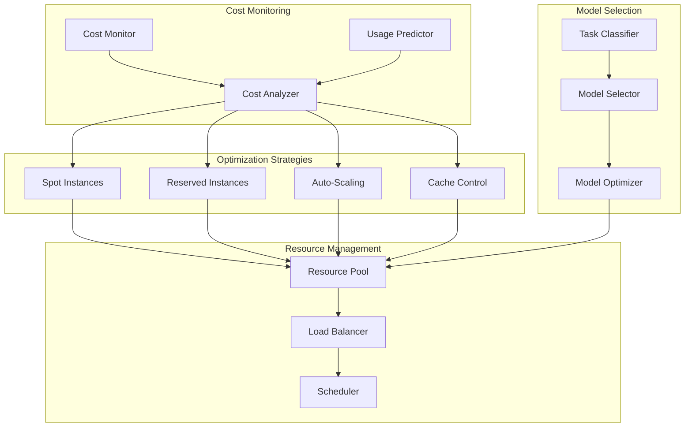
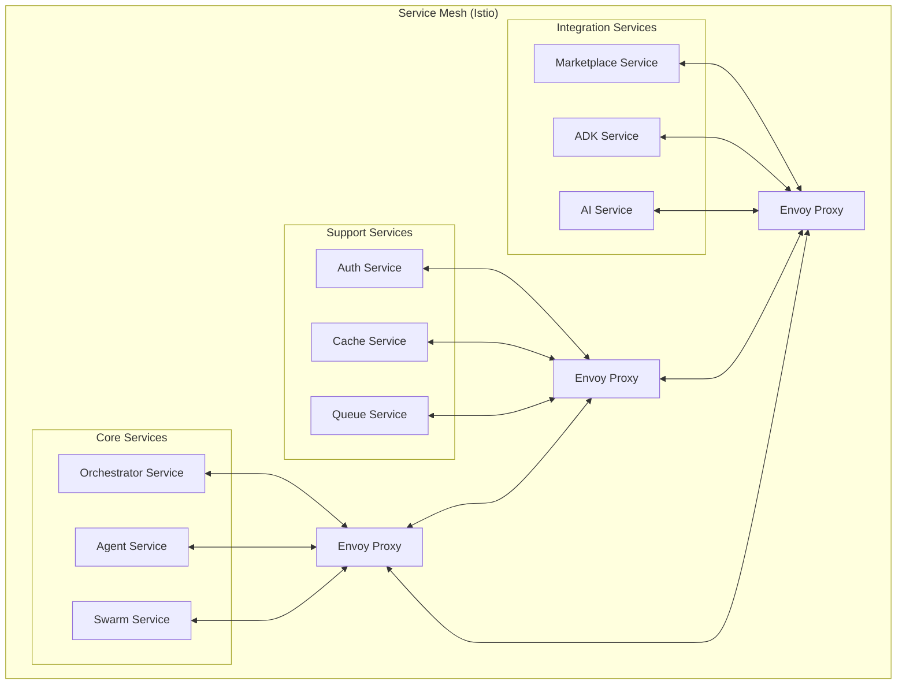

# 📊 Nexus Forge Architecture Diagrams & Technical Specifications

## 1. System Overview Architecture



## 2. Agent2Agent Communication Architecture



## 3. Marketplace Integration Flow



## 4. Swarm Intelligence Patterns

### 4.1 Hierarchical Swarm Pattern



### 4.2 Mesh Network Pattern



## 5. Technical Specifications

### 5.1 Performance Specifications

```yaml
performance_requirements:
  latency:
    agent_communication: < 10ms
    task_assignment: < 50ms
    swarm_formation: < 100ms
    marketplace_search: < 500ms
  
  throughput:
    messages_per_second: 100,000
    concurrent_agents: 1,000
    parallel_tasks: 10,000
    api_requests: 50,000/s
  
  scalability:
    horizontal_scaling: linear up to 1000 nodes
    vertical_scaling: up to 128 cores per node
    memory_efficiency: < 100MB per agent
    network_bandwidth: < 1Mbps per agent
```

### 5.2 Security Specifications

```yaml
security_requirements:
  authentication:
    method: OAuth2 + mTLS
    token_expiry: 1 hour
    refresh_token: 24 hours
    
  encryption:
    data_at_rest: AES-256-GCM
    data_in_transit: TLS 1.3
    key_rotation: 30 days
    
  access_control:
    model: RBAC + ABAC
    granularity: per-capability
    audit_logging: comprehensive
    
  compliance:
    standards: [SOC2, GDPR, HIPAA]
    certifications: [ISO27001, PCI-DSS]
```

### 5.3 API Specifications

```yaml
openapi: 3.0.0
info:
  title: Nexus Forge Multi-Agent API
  version: 2.0.0

paths:
  /agents:
    post:
      summary: Create new agent
      requestBody:
        content:
          application/json:
            schema:
              $ref: '#/components/schemas/AgentConfig'
      responses:
        201:
          description: Agent created
          
  /swarms:
    post:
      summary: Create agent swarm
      requestBody:
        content:
          application/json:
            schema:
              $ref: '#/components/schemas/SwarmConfig'
      responses:
        201:
          description: Swarm created
          
  /marketplace/search:
    get:
      summary: Search marketplace
      parameters:
        - name: query
          in: query
          required: true
          schema:
            type: string
        - name: type
          in: query
          schema:
            type: string
            enum: [tool, agent, template]
      responses:
        200:
          description: Search results

components:
  schemas:
    AgentConfig:
      type: object
      properties:
        type:
          type: string
          enum: [researcher, coder, analyst, tester]
        capabilities:
          type: array
          items:
            type: string
        model:
          type: string
          default: gemini-2.5-flash-thinking
    
    SwarmConfig:
      type: object
      properties:
        pattern:
          type: string
          enum: [hierarchical, mesh, adaptive]
        objective:
          type: string
        agents:
          type: array
          items:
            $ref: '#/components/schemas/AgentConfig'
        coordination:
          type: string
          enum: [centralized, distributed, stigmergic]
```

## 6. Deployment Architecture



## 7. Data Flow Architecture



## 8. Monitoring Architecture



## 9. Cost Optimization Architecture



## 10. Integration Points

### 10.1 External Service Integration

```yaml
integrations:
  google_services:
    - service: Gemini API
      purpose: Deep reasoning and thinking
      protocol: REST + gRPC
      auth: API Key + OAuth2
      
    - service: Jules API
      purpose: Autonomous code improvement
      protocol: REST
      auth: OAuth2
      
    - service: ADK Framework
      purpose: Native agent development
      protocol: SDK
      auth: Service Account
      
  marketplace_integrations:
    - service: MCP Marketplace
      purpose: Tool discovery and installation
      protocol: REST
      auth: API Key
      
    - service: LangChain Hub
      purpose: Chain templates
      protocol: REST
      auth: Token
      
    - service: HuggingFace
      purpose: Model loading
      protocol: REST + Python SDK
      auth: Token
      
  infrastructure:
    - service: Google Cloud Platform
      components: [GKE, CloudSQL, Redis, GCS]
      auth: Service Account
      
    - service: GitHub
      purpose: Code repository and CI/CD
      protocol: REST + GraphQL
      auth: Personal Access Token
```

### 10.2 Internal Service Mesh



---

These architecture diagrams and technical specifications provide a comprehensive visual and technical overview of the Nexus Forge ADK-native multi-agent system, demonstrating the sophisticated design required to win the Google ADK Hackathon.