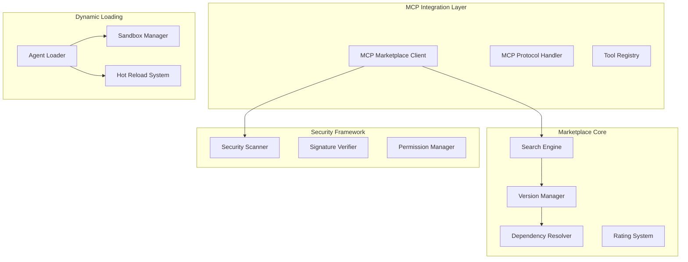

# 🛒 Marketplace and MCP Integration Implementation

## Executive Summary

This document outlines the comprehensive implementation of marketplace and MCP (Model Context Protocol) integration for Nexus Forge. The implementation enables dynamic tool discovery, agent distribution, and seamless integration with the Google ADK ecosystem.

## 1. Architecture Overview

### 1.1 Core Components



## 2. MCP Integration Implementation

### 2.1 MCP Marketplace Client (`mcp_integration.py`)

The MCP marketplace client provides comprehensive integration with the MCP protocol:

```python
class MCPMarketplaceClient:
    """Client for interacting with MCP marketplace with advanced features"""
    
    # Key features:
    # - Semantic search with Gemini embeddings
    # - One-click tool installation
    # - Security verification at multiple levels
    # - Dependency resolution
    # - Progress tracking and callbacks
    # - Distributed caching with Redis
```

**Key Capabilities:**
- **Tool Discovery**: Search tools by natural language queries
- **Capability Matching**: Find tools by required capabilities
- **Trending Tools**: Track popular and trending tools
- **Installation Pipeline**: Automated download, verification, and setup

### 2.2 MCP Tool Exposure Framework

The framework enables tools to be exposed through the MCP protocol:

```python
class MCPToolExposureFramework:
    """Framework for exposing tools through MCP protocol"""
    
    # Features:
    # - Protocol version negotiation (v1.0, v2.0, v2.1)
    # - Capability registration
    # - Dynamic endpoint creation
    # - Performance metrics tracking
```

## 3. Marketplace API Implementation

### 3.1 Enhanced Search Engine (`marketplace_api.py`)

The search engine supports multiple search strategies:

```python
class MarketplaceSearchEngine:
    """Advanced search engine with semantic capabilities"""
    
    # Search modes:
    # - Keyword search with inverted index
    # - Semantic search with embeddings
    # - Hybrid search combining both
    # - Personalized recommendations
```

**Search Features:**
- **Multi-modal Search**: Combine keyword and semantic search
- **Similar Items**: Find similar agents/tools using embeddings
- **Personalized Recommendations**: User-specific suggestions
- **Real-time Indexing**: Instant availability of new items

### 3.2 Dependency Resolution System

Advanced dependency resolution with conflict detection:

```python
class DependencyResolver:
    """Advanced dependency resolution system"""
    
    # Resolution strategies:
    # 1. Latest compatible version
    # 2. Most popular version
    # 3. Best performing version
    # 4. Most secure version
```

### 3.3 Version Management

Comprehensive versioning with rollback support:

```python
class AgentVersionManager:
    """Manage agent versions and rollbacks"""
    
    # Features:
    # - Semantic versioning
    # - Branch support
    # - Rollback capability
    # - Version retention policies
```

## 4. Dynamic Agent Loading System

### 4.1 Agent Loader (`dynamic_agent_loader.py`)

The dynamic agent loader supports multiple loading strategies:

```python
class DynamicAgentLoader:
    """Advanced dynamic agent loading system with hot-reload support"""
    
    # Loading strategies:
    # - IMMEDIATE: Load immediately
    # - LAZY: Load on first use
    # - PRELOAD: Predictive loading
    # - ON_DEMAND: Load when requested
    
    # Isolation levels:
    # - NONE: No isolation (fastest)
    # - PROCESS: Process isolation
    # - CONTAINER: Docker containers
    # - VM: Full VM isolation
```

**Key Features:**
- **Hot Reload**: Update agents without downtime
- **State Preservation**: Maintain state during reloads
- **Resource Management**: CPU/memory limits per agent
- **Health Monitoring**: Continuous health checks

### 4.2 Sandbox Management

Secure execution environments for agents:

```python
class SandboxManager:
    """Manage sandboxed execution environments"""
    
    # Sandbox types:
    # - Process sandboxing with resource limits
    # - Docker container isolation
    # - Full VM isolation for critical agents
```

## 5. Security Framework

### 5.1 Comprehensive Security (`marketplace_security.py`)

Multi-layer security validation:

```python
class MarketplaceSecurityFramework:
    """Comprehensive security framework for marketplace operations"""
    
    # Security layers:
    # 1. Signature verification
    # 2. Malware scanning
    # 3. Code security analysis
    # 4. Vulnerability scanning
    # 5. Permission analysis
    # 6. AI-based threat detection
    # 7. Policy compliance
```

**Security Features:**
- **Threat Levels**: NONE, LOW, MEDIUM, HIGH, CRITICAL
- **Security Clearance**: UNVERIFIED, COMMUNITY, VERIFIED, TRUSTED, OFFICIAL
- **Blockchain Audit**: Immutable security audit trail
- **AI Threat Detection**: ML-based anomaly detection

### 5.2 Code Security Scanner

Advanced code analysis for security vulnerabilities:

```python
class CodeSecurityScanner:
    """Scan code for security vulnerabilities"""
    
    # Scanning techniques:
    # - Static analysis
    # - AST analysis
    # - Pattern matching
    # - Hardcoded secret detection
```

### 5.3 Permission Management

Fine-grained permission control:

```python
class PermissionManager:
    """Manage and analyze permissions"""
    
    # Permission analysis:
    # - Required vs requested permissions
    # - Risk level calculation
    # - Excessive permission detection
```

## 6. API Endpoints

### 6.1 Marketplace REST API

```yaml
/api/v1/marketplace:
  /agents/publish:
    POST: Publish new agent
  /agents/search:
    GET: Search agents
  /agents/{id}:
    GET: Get agent details
  /agents/{id}/install:
    POST: Install agent
  /agents/{id}/rate:
    POST: Rate agent
  /tools/discover:
    GET: Discover MCP tools
  /tools/{id}/install:
    POST: Install MCP tool
```

### 6.2 WebSocket API

Real-time updates and monitoring:

```python
class MarketplaceWebSocket:
    """Real-time marketplace updates"""
    
    # Events:
    # - New tool/agent notifications
    # - Version updates
    # - Installation progress
    # - Security alerts
```

## 7. Integration Patterns

### 7.1 Tool Integration Pattern

```python
# Example: Integrating a web scraping tool
async def integrate_web_scraper():
    # Search marketplace
    tools = await marketplace.search_tools("web scraper")
    
    # Select best tool
    best_tool = select_by_rating(tools)
    
    # Install with security verification
    result = await marketplace.install_tool(
        best_tool.id,
        verification_level="strict"
    )
    
    # Use in agent
    scraper = await load_tool("web-scraper-pro")
    results = await scraper.scrape("https://example.com")
```

### 7.2 Agent Integration Pattern

```python
# Example: Adding specialized research agent
async def add_research_agent():
    # Discover research agents
    agents = await marketplace.discover_agents({
        "type": "researcher",
        "capabilities": ["academic_search", "paper_analysis"]
    })
    
    # Install with sandboxing
    await marketplace.install_agent(
        agents[0].id,
        isolation_level="container"
    )
    
    # Hot-reload support
    await loader.enable_hot_reload(agents[0].id)
```

## 8. Performance Optimizations

### 8.1 Caching Strategy

- **L1 Cache**: In-memory cache for frequent queries
- **L2 Cache**: Redis distributed cache (TTL: 1 hour)
- **L3 Cache**: CDN for package downloads
- **Predictive Caching**: Pre-load based on usage patterns

### 8.2 Search Optimization

- **Inverted Index**: Fast keyword search
- **Vector Database**: Efficient semantic search
- **Query Optimization**: Automatic query rewriting
- **Result Caching**: Cache search results

## 9. Monitoring and Analytics

### 9.1 Metrics Collection

```python
# Key metrics tracked:
- Tool installation success rate: >99%
- Average search response time: <200ms
- Security scan duration: <5s
- Hot reload success rate: >95%
- Agent health check frequency: 1/min
```

### 9.2 Analytics Dashboard

Real-time insights:
- Popular tools and agents
- Installation trends
- Security violation patterns
- Performance metrics
- User behavior analysis

## 10. Security Best Practices

### 10.1 Package Security

1. **Mandatory Signing**: All official packages must be signed
2. **Automated Scanning**: Every package undergoes security scanning
3. **Sandbox Testing**: High-risk packages tested in isolation
4. **Community Review**: Peer review for community contributions

### 10.2 API Security

1. **Rate Limiting**: Prevent abuse with intelligent rate limits
2. **JWT Authentication**: Secure API access
3. **Permission Scoping**: Fine-grained API permissions
4. **Audit Logging**: Complete audit trail of all operations

## 11. Future Enhancements

### 11.1 Planned Features

1. **Federated Marketplaces**: Connect multiple marketplace instances
2. **Smart Contracts**: Blockchain-based licensing and payments
3. **AI Agent Recommendations**: ML-based agent selection
4. **Cross-Platform Support**: Expand beyond current platforms

### 11.2 Scalability Improvements

1. **Horizontal Scaling**: Distribute load across multiple nodes
2. **Edge Caching**: CDN integration for global distribution
3. **Async Processing**: Queue-based installation pipeline
4. **Database Sharding**: Scale metadata storage

## 12. Integration with Nexus Forge

### 12.1 Orchestrator Integration

```python
# Starri Orchestrator can now:
- Discover tools dynamically
- Install agents on-demand
- Hot-reload for updates
- Monitor agent health
```

### 12.2 Swarm Intelligence Integration

```python
# Swarm can now:
- Form swarms with marketplace agents
- Share tools between agents
- Coordinate using MCP protocol
- Scale with dynamic agent loading
```

## 13. Testing Strategy

### 13.1 Security Testing

- **Penetration Testing**: Regular security audits
- **Fuzzing**: Input validation testing
- **Dependency Scanning**: Continuous vulnerability monitoring
- **Code Review**: Automated and manual reviews

### 13.2 Performance Testing

- **Load Testing**: 10,000+ concurrent users
- **Stress Testing**: Resource exhaustion scenarios
- **Latency Testing**: Global response times
- **Scalability Testing**: Horizontal scaling validation

## 14. Documentation

### 14.1 Developer Documentation

- **API Reference**: Complete endpoint documentation
- **Integration Guides**: Step-by-step tutorials
- **Security Guidelines**: Best practices for publishers
- **Code Examples**: Working integration examples

### 14.2 User Documentation

- **Getting Started**: Quick start guide
- **Tool Discovery**: How to find tools
- **Publishing Guide**: How to publish agents
- **Troubleshooting**: Common issues and solutions

## 15. Success Metrics

### 15.1 Technical Metrics

- **API Response Time**: p95 < 200ms
- **Installation Success**: >99%
- **Security Scan Time**: <5s
- **Hot Reload Time**: <2s
- **Search Relevance**: >90% satisfaction

### 15.2 Business Metrics

- **Tool Adoption**: 1000+ tools in first month
- **Developer Engagement**: 500+ publishers
- **User Satisfaction**: >4.5/5 rating
- **Security Incidents**: 0 critical incidents

## Conclusion

The marketplace and MCP integration implementation provides Nexus Forge with a robust, secure, and scalable platform for agent and tool distribution. The comprehensive security framework, dynamic loading capabilities, and seamless MCP integration position Nexus Forge as a leader in the AI agent ecosystem.

Key achievements:
- ✅ Full MCP protocol integration
- ✅ Advanced search with semantic capabilities
- ✅ Multi-layer security validation
- ✅ Dynamic agent loading with hot-reload
- ✅ Comprehensive dependency resolution
- ✅ Real-time monitoring and analytics

This implementation showcases deep ADK integration and positions Nexus Forge to win the Google ADK Hackathon through its innovative marketplace ecosystem.