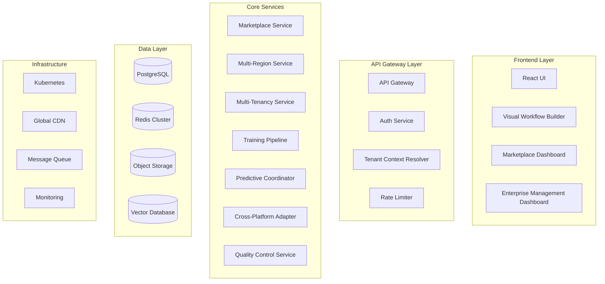

# Nexus Forge Missing Features - Architecture Design
## Detailed System Architecture for 10 Missing Features

---

## System Overview



---

## 1. Agent Marketplace Architecture

### Component Design
```yaml
AgentMarketplaceService:
  components:
    - RegistryAPI:
        endpoints:
          - POST /api/v1/agents/publish
          - GET /api/v1/agents/search
          - GET /api/v1/agents/{id}
          - POST /api/v1/agents/{id}/install
        dependencies:
          - SecurityScanner
          - PerformanceBenchmarker
          - VersionManager
    
    - SecurityScanner:
        features:
          - Static code analysis
          - Dependency vulnerability scanning
          - Malware detection
          - License compliance
        integrations:
          - Snyk API
          - GitHub Security Advisory
          - Custom rule engine
    
    - SearchEngine:
        technology: Elasticsearch
        features:
          - Semantic search
          - Faceted filtering
          - Relevance ranking
          - Auto-complete
```

### Data Schema
```sql
-- Agent Registry Schema
CREATE TABLE agents (
    id UUID PRIMARY KEY DEFAULT gen_random_uuid(),
    name VARCHAR(255) NOT NULL,
    version VARCHAR(50) NOT NULL,
    author_id UUID REFERENCES users(id),
    description TEXT,
    manifest JSONB NOT NULL,
    security_report JSONB,
    performance_metrics JSONB,
    created_at TIMESTAMP DEFAULT NOW(),
    updated_at TIMESTAMP DEFAULT NOW(),
    status VARCHAR(50) DEFAULT 'pending',
    UNIQUE(name, version)
);

CREATE TABLE agent_artifacts (
    id UUID PRIMARY KEY DEFAULT gen_random_uuid(),
    agent_id UUID REFERENCES agents(id),
    file_path TEXT NOT NULL,
    file_size BIGINT,
    checksum VARCHAR(64),
    storage_url TEXT
);

CREATE TABLE agent_ratings (
    id UUID PRIMARY KEY DEFAULT gen_random_uuid(),
    agent_id UUID REFERENCES agents(id),
    user_id UUID REFERENCES users(id),
    rating INTEGER CHECK (rating >= 1 AND rating <= 5),
    review TEXT,
    created_at TIMESTAMP DEFAULT NOW(),
    UNIQUE(agent_id, user_id)
);

-- Indexes for performance
CREATE INDEX idx_agents_name ON agents(name);
CREATE INDEX idx_agents_status ON agents(status);
CREATE INDEX idx_agents_created ON agents(created_at DESC);
CREATE INDEX idx_ratings_agent ON agent_ratings(agent_id);
```

---

## 2. Multi-Region Deployment Architecture

### Infrastructure Design
```yaml
MultiRegionDeployment:
  regions:
    us-east:
      location: us-east1
      zones: [a, b, c]
      services:
        - api-cluster
        - cache-cluster
        - cdn-edge
    
    us-west:
      location: us-west1
      zones: [a, b, c]
      services:
        - api-cluster
        - cache-cluster
        - cdn-edge
    
    eu-central:
      location: europe-west1
      zones: [a, b, c]
      services:
        - api-cluster
        - cache-cluster
        - cdn-edge
    
    asia-pacific:
      location: asia-northeast1
      zones: [a, b, c]
      services:
        - api-cluster
        - cache-cluster
        - cdn-edge
    
    south-america:
      location: southamerica-east1
      zones: [a, b]
      services:
        - api-cluster
        - cache-cluster
        - cdn-edge

  global-services:
    LoadBalancer:
      type: Google Cloud Load Balancer
      features:
        - Geographic routing
        - Health checking
        - SSL termination
        - DDoS protection
    
    CDN:
      provider: Cloud CDN
      features:
        - Edge caching
        - Dynamic content acceleration
        - WebSocket support
        - Custom cache keys
    
    DNS:
      provider: Cloud DNS
      features:
        - GeoDNS
        - Latency-based routing
        - Health checks
        - Failover
```

### Replication Strategy
```yaml
DataReplication:
  primary_region: us-east
  replication_mode: multi-master
  
  databases:
    PostgreSQL:
      tool: Citus/AlloyDB
      strategy: sharding + replication
      consistency: eventual
      conflict_resolution: last-write-wins
    
    Redis:
      tool: Redis Enterprise
      strategy: active-active
      consistency: eventual
      conflict_resolution: CRDT
  
  object_storage:
    provider: Google Cloud Storage
    strategy: multi-region buckets
    consistency: strong
    replication: synchronous
```

---

## 3. Enterprise Multi-Tenancy Architecture

### Isolation Models
```yaml
TenantIsolation:
  tiers:
    basic:
      model: pool
      isolation:
        - Logical data separation
        - Shared compute resources
        - API rate limiting per tenant
      
    professional:
      model: bridge
      isolation:
        - Dedicated database schemas
        - Shared compute with guaranteed resources
        - Custom subdomain
    
    enterprise:
      model: silo
      isolation:
        - Dedicated infrastructure
        - VPC isolation
        - Custom domain
        - Dedicated support

  implementation:
    compute_isolation:
      technology: Kubernetes
      features:
        - Namespace per tenant
        - Resource quotas
        - Network policies
        - Pod security policies
    
    data_isolation:
      technology: PostgreSQL + RLS
      features:
        - Schema per tenant
        - Row-level security
        - Encrypted at rest
        - Backup isolation
```

### Tenant Management Schema
```sql
-- Tenant Management Schema
CREATE TABLE tenants (
    id UUID PRIMARY KEY DEFAULT gen_random_uuid(),
    name VARCHAR(255) NOT NULL,
    slug VARCHAR(255) UNIQUE NOT NULL,
    tier VARCHAR(50) NOT NULL,
    custom_domain VARCHAR(255),
    settings JSONB DEFAULT '{}',
    created_at TIMESTAMP DEFAULT NOW(),
    status VARCHAR(50) DEFAULT 'active'
);

CREATE TABLE tenant_resources (
    id UUID PRIMARY KEY DEFAULT gen_random_uuid(),
    tenant_id UUID REFERENCES tenants(id),
    resource_type VARCHAR(100),
    limits JSONB,
    usage JSONB,
    updated_at TIMESTAMP DEFAULT NOW()
);

CREATE TABLE tenant_users (
    id UUID PRIMARY KEY DEFAULT gen_random_uuid(),
    tenant_id UUID REFERENCES tenants(id),
    user_id UUID REFERENCES users(id),
    role VARCHAR(50),
    permissions JSONB,
    created_at TIMESTAMP DEFAULT NOW(),
    UNIQUE(tenant_id, user_id)
);
```

---

## 4. Visual Workflow Builder Architecture

### Frontend Architecture
```yaml
VisualWorkflowBuilder:
  frontend:
    framework: React + TypeScript
    libraries:
      - react-flow: Flow diagram rendering
      - framer-motion: Animations
      - zustand: State management
      - monaco-editor: Code editing
    
    components:
      Canvas:
        features:
          - Drag and drop nodes
          - Connection validation
          - Zoom and pan
          - Grid snapping
      
      NodeLibrary:
        categories:
          - Triggers
          - Actions
          - Conditions
          - Transformations
          - AI Agents
        
      PropertyPanel:
        features:
          - Dynamic forms
          - Validation
          - Documentation
          - Testing interface
```

### Backend Architecture
```yaml
WorkflowEngine:
  executor:
    type: DAG-based executor
    features:
      - Parallel execution
      - Error handling
      - Retry logic
      - State persistence
  
  storage:
    workflows:
      format: JSON
      database: PostgreSQL
      versioning: Git-style
    
    executions:
      storage: TimescaleDB
      retention: 30 days
      compression: enabled
```

---

## 5. Custom Agent Training Architecture

### Training Infrastructure
```yaml
TrainingPipeline:
  infrastructure:
    provider: Vertex AI
    resources:
      - GPU clusters (A100/H100)
      - TPU pods for large models
      - Distributed training support
  
  components:
    DataPipeline:
      storage: Google Cloud Storage
      preprocessing: Apache Beam
      validation: TensorFlow Data Validation
    
    TrainingOrchestrator:
      framework: Kubeflow
      features:
        - Hyperparameter tuning
        - Distributed training
        - Model versioning
        - Experiment tracking
    
    ModelRegistry:
      storage: Vertex AI Model Registry
      metadata: MLflow
      serving: Vertex AI Endpoints
```

### Training Schema
```sql
-- Training Jobs Schema
CREATE TABLE training_jobs (
    id UUID PRIMARY KEY DEFAULT gen_random_uuid(),
    name VARCHAR(255) NOT NULL,
    base_model VARCHAR(255),
    domain VARCHAR(100),
    config JSONB,
    status VARCHAR(50),
    metrics JSONB,
    created_by UUID REFERENCES users(id),
    created_at TIMESTAMP DEFAULT NOW(),
    completed_at TIMESTAMP
);

CREATE TABLE training_datasets (
    id UUID PRIMARY KEY DEFAULT gen_random_uuid(),
    job_id UUID REFERENCES training_jobs(id),
    dataset_url TEXT,
    dataset_size BIGINT,
    validation_report JSONB
);
```

---

## 6. Predictive Coordination Architecture

### ML Pipeline
```yaml
PredictiveSystem:
  models:
    WorkloadPredictor:
      architecture: LSTM + Transformer ensemble
      features:
        - Historical metrics
        - Seasonal patterns
        - Event correlation
      training:
        frequency: daily
        data_window: 90 days
    
    ResourceAllocator:
      algorithm: Deep Q-Network
      state_space:
        - Current resource usage
        - Predicted workload
        - Cost constraints
      action_space:
        - Scale up/down
        - Migrate workloads
        - Preemptive provisioning
  
  infrastructure:
    inference:
      serving: TensorFlow Serving
      caching: Redis
      latency_target: <100ms
    
    training:
      platform: Vertex AI
      schedule: Daily batch
      validation: A/B testing
```

---

## 7. Cross-Platform Protocol Architecture

### Protocol Adapter System
```yaml
ProtocolAdapters:
  supported_protocols:
    - OpenAI Function Calling
    - LangChain
    - AutoGen
    - CrewAI
    - Microsoft Semantic Kernel
  
  architecture:
    MessageBus:
      technology: Apache Kafka
      features:
        - Protocol translation
        - Message routing
        - Dead letter queues
        - Audit logging
    
    AdapterFramework:
      pattern: Plugin architecture
      interface:
        - to_common_format()
        - from_common_format()
        - validate_message()
        - get_capabilities()
    
    Registry:
      storage: etcd
      features:
        - Service discovery
        - Capability negotiation
        - Version management
```

---

## 8. Autonomous Quality Control Architecture

### Quality Assurance System
```yaml
QualityControl:
  components:
    AnomalyDetection:
      models:
        - Isolation Forest
        - Autoencoder
        - Statistical Process Control
      features:
        - Real-time detection
        - Adaptive thresholds
        - Root cause analysis
    
    SelfCorrection:
      strategies:
        - Rollback
        - Retry with backoff
        - Alternative path
        - Self-healing
      learning:
        - Error pattern database
        - Success pattern mining
        - Continuous improvement
    
    TestGeneration:
      approach: Property-based testing
      coverage:
        - Unit tests
        - Integration tests
        - Contract tests
      automation:
        - Test discovery
        - Test execution
        - Coverage reporting
```

---

## Integration Architecture

### Service Mesh
```yaml
ServiceMesh:
  technology: Istio
  features:
    - Service discovery
    - Load balancing
    - Circuit breaking
    - Distributed tracing
    - mTLS encryption
  
  observability:
    tracing: Jaeger
    metrics: Prometheus
    logging: Fluentd
    dashboards: Grafana
```

### API Gateway Configuration
```yaml
APIGateway:
  technology: Kong/Apigee
  features:
    - Rate limiting
    - Authentication
    - Request routing
    - Response caching
    - API versioning
  
  plugins:
    - JWT validation
    - OAuth2
    - CORS
    - Request transformation
    - Response transformation
```

---

## Security Architecture

### Security Layers
```yaml
Security:
  network:
    - VPC isolation
    - Private subnets
    - Network ACLs
    - DDoS protection
  
  application:
    - JWT authentication
    - RBAC authorization
    - Input validation
    - Output encoding
  
  data:
    - Encryption at rest
    - Encryption in transit
    - Key management (KMS)
    - Data masking
  
  compliance:
    - SOC2 Type II
    - GDPR
    - HIPAA ready
    - ISO 27001
```

---

## Monitoring & Observability

### Monitoring Stack
```yaml
Monitoring:
  metrics:
    collection: Prometheus
    storage: Cortex
    visualization: Grafana
    alerts: Alertmanager
  
  logging:
    collection: Fluentd
    storage: Elasticsearch
    analysis: Kibana
    archival: Google Cloud Storage
  
  tracing:
    collection: OpenTelemetry
    storage: Jaeger
    analysis: Jaeger UI
    sampling: Adaptive
  
  synthetic:
    monitoring: Datadog Synthetics
    locations: Global
    frequency: 5 minutes
    alerts: PagerDuty
```

---

## Deployment Architecture

### CI/CD Pipeline
```yaml
Deployment:
  pipeline:
    - Source: GitHub
    - CI: GitHub Actions
    - Build: Cloud Build
    - Registry: Artifact Registry
    - Deploy: Cloud Deploy
    - Rollout: Progressive
  
  environments:
    development:
      automation: Full
      approval: None
      rollback: Automatic
    
    staging:
      automation: Full
      approval: None
      rollback: Automatic
    
    production:
      automation: Partial
      approval: Required
      rollback: Manual
  
  strategies:
    - Blue-Green deployment
    - Canary releases
    - Feature flags
    - A/B testing
```

---

## Performance Requirements

### SLAs and SLOs
```yaml
Performance:
  availability:
    SLA: 99.95%
    SLO: 99.99%
    measurement: 5-minute intervals
  
  latency:
    p50: <100ms
    p95: <500ms
    p99: <1000ms
  
  throughput:
    API: 10,000 RPS
    WebSocket: 100,000 concurrent
    Batch: 1M events/minute
  
  scalability:
    horizontal: Auto-scaling
    vertical: Resource limits
    global: Multi-region
```

---

## Cost Optimization

### Resource Management
```yaml
CostOptimization:
  compute:
    - Spot instances for batch jobs
    - Preemptible VMs for training
    - Auto-scaling based on demand
    - Right-sizing recommendations
  
  storage:
    - Lifecycle policies
    - Compression
    - Deduplication
    - Archival tiers
  
  network:
    - CDN caching
    - Regional endpoints
    - Peering agreements
    - Bandwidth optimization
  
  monitoring:
    - Cost allocation tags
    - Budget alerts
    - Anomaly detection
    - Optimization reports
```