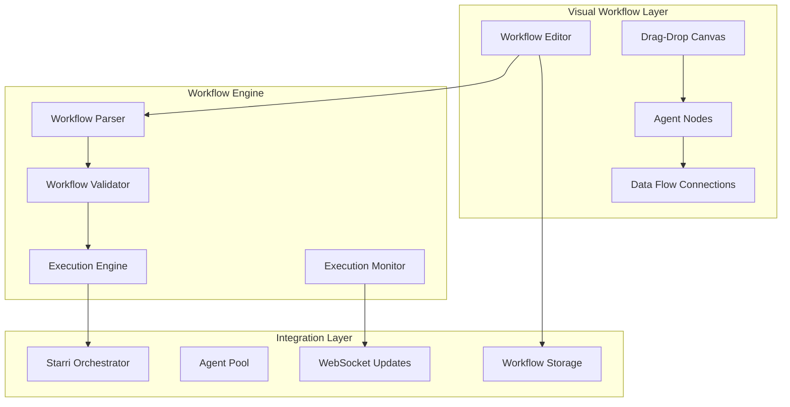

# 🎨 Visual Workflow Architecture for Agent Composition

## Executive Summary

This document defines the visual workflow system architecture for Nexus Forge, enabling intuitive drag-and-drop composition of multi-agent workflows with real-time execution visualization.

## 1. Core Architecture Overview

### 1.1 System Components

```typescript
interface WorkflowSystem {
  editor: WorkflowEditor;           // Visual drag-drop editor
  runtime: WorkflowRuntime;         // Execution engine
  visualizer: ExecutionVisualizer;  // Real-time visualization
  serializer: WorkflowSerializer;   // Save/load workflows
  debugger: WorkflowDebugger;       // Visual debugging tools
}
```

### 1.2 Architecture Diagram



## 2. Visual Workflow Components

### 2.1 Node System Architecture

```typescript
// Base node interface for all workflow nodes
interface WorkflowNode {
  id: string;
  type: NodeType;
  position: { x: number; y: number };
  data: {
    label: string;
    agentType: AgentType;
    config: AgentConfig;
    inputs: InputPort[];
    outputs: OutputPort[];
  };
  style: NodeStyle;
  state: NodeState;
}

enum NodeType {
  AGENT = 'agent',
  TRIGGER = 'trigger',
  CONDITION = 'condition',
  TRANSFORM = 'transform',
  OUTPUT = 'output',
  SUBFLOW = 'subflow'
}

enum AgentType {
  STARRI = 'starri',
  JULES = 'jules',
  GEMINI = 'gemini',
  RESEARCHER = 'researcher',
  DEVELOPER = 'developer',
  DESIGNER = 'designer',
  TESTER = 'tester',
  CUSTOM = 'custom'
}

interface InputPort {
  id: string;
  name: string;
  type: DataType;
  required: boolean;
  connected: boolean;
}

interface OutputPort {
  id: string;
  name: string;
  type: DataType;
  multiple: boolean;  // Can connect to multiple inputs
}
```

### 2.2 Connection System

```typescript
interface WorkflowConnection {
  id: string;
  source: {
    nodeId: string;
    portId: string;
  };
  target: {
    nodeId: string;
    portId: string;
  };
  type: ConnectionType;
  dataTransform?: DataTransform;
  style: ConnectionStyle;
}

enum ConnectionType {
  DATA_FLOW = 'data',
  CONTROL_FLOW = 'control',
  CONDITIONAL = 'conditional',
  PARALLEL = 'parallel',
  SEQUENTIAL = 'sequential'
}

interface DataTransform {
  type: 'map' | 'filter' | 'reduce' | 'custom';
  expression: string;
}
```

### 2.3 Canvas and Interaction System

```typescript
interface WorkflowCanvas {
  nodes: Map<string, WorkflowNode>;
  connections: Map<string, WorkflowConnection>;
  viewport: {
    x: number;
    y: number;
    zoom: number;
  };
  grid: {
    size: number;
    snap: boolean;
    visible: boolean;
  };
  selection: {
    nodes: Set<string>;
    connections: Set<string>;
  };
}

interface DragDropContext {
  draggedNode: WorkflowNode | null;
  draggedPort: Port | null;
  dropZones: DropZone[];
  connectionPreview: ConnectionPreview | null;
}
```

## 3. Workflow Serialization Format

### 3.1 Workflow Definition Schema

```typescript
interface WorkflowDefinition {
  id: string;
  version: string;
  metadata: {
    name: string;
    description: string;
    author: string;
    created: Date;
    modified: Date;
    tags: string[];
  };
  nodes: WorkflowNode[];
  connections: WorkflowConnection[];
  variables: WorkflowVariable[];
  triggers: WorkflowTrigger[];
  settings: WorkflowSettings;
}

interface WorkflowVariable {
  name: string;
  type: DataType;
  defaultValue: any;
  scope: 'global' | 'local';
}

interface WorkflowTrigger {
  id: string;
  type: 'manual' | 'schedule' | 'event' | 'webhook';
  config: TriggerConfig;
}
```

### 3.2 JSON Serialization Example

```json
{
  "id": "wf_nexus_app_builder",
  "version": "1.0.0",
  "metadata": {
    "name": "Full-Stack App Builder",
    "description": "Automated full-stack application development workflow"
  },
  "nodes": [
    {
      "id": "node_1",
      "type": "agent",
      "position": { "x": 100, "y": 100 },
      "data": {
        "label": "Requirements Analyzer",
        "agentType": "starri",
        "config": {
          "mode": "analyzer",
          "parameters": {
            "depth": "comprehensive"
          }
        },
        "outputs": [
          {
            "id": "requirements",
            "name": "Requirements",
            "type": "object"
          }
        ]
      }
    },
    {
      "id": "node_2",
      "type": "agent",
      "position": { "x": 400, "y": 100 },
      "data": {
        "label": "Architecture Designer",
        "agentType": "gemini",
        "config": {
          "model": "gemini-2.5-flash-thinking"
        },
        "inputs": [
          {
            "id": "requirements",
            "name": "Requirements",
            "type": "object",
            "required": true
          }
        ]
      }
    }
  ],
  "connections": [
    {
      "id": "conn_1",
      "source": {
        "nodeId": "node_1",
        "portId": "requirements"
      },
      "target": {
        "nodeId": "node_2",
        "portId": "requirements"
      },
      "type": "data"
    }
  ]
}
```

## 4. Drag-and-Drop Implementation

### 4.1 React DnD Integration

```typescript
import { DndProvider, useDrag, useDrop } from 'react-dnd';
import { HTML5Backend } from 'react-dnd-html5-backend';

interface DraggableNode {
  type: string;
  agentType: AgentType;
  label: string;
  icon: React.ComponentType;
}

const NodePalette: React.FC = () => {
  const availableNodes: DraggableNode[] = [
    { type: 'agent', agentType: 'starri', label: 'Starri AI', icon: Brain },
    { type: 'agent', agentType: 'jules', label: 'Jules Coder', icon: Code },
    { type: 'agent', agentType: 'researcher', label: 'Researcher', icon: Search },
    { type: 'condition', agentType: null, label: 'Condition', icon: GitBranch },
    { type: 'transform', agentType: null, label: 'Transform', icon: Shuffle }
  ];
  
  return (
    <div className="node-palette">
      {availableNodes.map(node => (
        <DraggableNodeItem key={node.type + node.agentType} node={node} />
      ))}
    </div>
  );
};
```

### 4.2 Canvas Drop Zone

```typescript
const WorkflowCanvas: React.FC = () => {
  const [nodes, setNodes] = useState<Map<string, WorkflowNode>>(new Map());
  const [connections, setConnections] = useState<Map<string, WorkflowConnection>>(new Map());
  
  const [{ isOver }, drop] = useDrop({
    accept: 'node',
    drop: (item: DraggableNode, monitor) => {
      const offset = monitor.getClientOffset();
      if (offset) {
        addNode({
          type: item.type,
          agentType: item.agentType,
          position: { x: offset.x, y: offset.y }
        });
      }
    },
    collect: (monitor) => ({
      isOver: !!monitor.isOver()
    })
  });
  
  return (
    <div ref={drop} className="workflow-canvas">
      <svg className="connections-layer">
        {Array.from(connections.values()).map(conn => (
          <ConnectionPath key={conn.id} connection={conn} nodes={nodes} />
        ))}
      </svg>
      <div className="nodes-layer">
        {Array.from(nodes.values()).map(node => (
          <WorkflowNodeComponent key={node.id} node={node} />
        ))}
      </div>
    </div>
  );
};
```

## 5. Real-time Execution Visualization

### 5.1 Execution State Management

```typescript
interface ExecutionState {
  workflowId: string;
  status: 'idle' | 'running' | 'paused' | 'completed' | 'failed';
  nodeStates: Map<string, NodeExecutionState>;
  dataFlow: Map<string, any>;
  logs: ExecutionLog[];
  metrics: ExecutionMetrics;
}

interface NodeExecutionState {
  nodeId: string;
  status: 'waiting' | 'running' | 'completed' | 'failed' | 'skipped';
  progress: number;
  startTime?: Date;
  endTime?: Date;
  error?: Error;
  output?: any;
}

// WebSocket integration for real-time updates
const useExecutionState = (workflowId: string) => {
  const [executionState, setExecutionState] = useState<ExecutionState>();
  const { subscribe } = useWebSocket();
  
  useEffect(() => {
    const unsubscribe = subscribe(`workflow.${workflowId}.execution`, (update) => {
      setExecutionState(prev => ({
        ...prev,
        ...update
      }));
    });
    
    return unsubscribe;
  }, [workflowId]);
  
  return executionState;
};
```

### 5.2 Visual Feedback System

```typescript
const NodeExecutionVisualizer: React.FC<{ node: WorkflowNode; state: NodeExecutionState }> = ({ node, state }) => {
  return (
    <div className={`node-visualizer ${state.status}`}>
      {state.status === 'running' && (
        <div className="execution-indicator">
          <div className="pulse-animation" />
          <ProgressBar progress={state.progress} />
        </div>
      )}
      {state.status === 'completed' && (
        <CheckCircle className="status-icon success" />
      )}
      {state.status === 'failed' && (
        <AlertCircle className="status-icon error" />
      )}
      <div className="execution-metrics">
        {state.startTime && (
          <span className="metric">
            Duration: {calculateDuration(state.startTime, state.endTime)}
          </span>
        )}
      </div>
    </div>
  );
};
```

## 6. Workflow Templates and Presets

### 6.1 Template System

```typescript
interface WorkflowTemplate {
  id: string;
  category: TemplateCategory;
  name: string;
  description: string;
  thumbnail: string;
  workflow: WorkflowDefinition;
  requirements: {
    agents: AgentType[];
    minNodes: number;
    estimatedTime: string;
  };
}

enum TemplateCategory {
  WEB_APP = 'web_app',
  MOBILE_APP = 'mobile_app',
  API_SERVICE = 'api_service',
  DATA_PIPELINE = 'data_pipeline',
  AI_MODEL = 'ai_model',
  AUTOMATION = 'automation'
}

const workflowTemplates: WorkflowTemplate[] = [
  {
    id: 'tpl_fullstack_web',
    category: TemplateCategory.WEB_APP,
    name: 'Full-Stack Web Application',
    description: 'Complete web app with React frontend and Node.js backend',
    workflow: {
      // Pre-configured workflow definition
    }
  },
  {
    id: 'tpl_ai_chatbot',
    category: TemplateCategory.AI_MODEL,
    name: 'AI Chatbot Service',
    description: 'Intelligent chatbot with natural language processing',
    workflow: {
      // Pre-configured workflow definition
    }
  }
];
```

## 7. Integration with Existing System

### 7.1 Orchestrator Integration

```typescript
class WorkflowExecutor {
  private orchestrator: StarriOrchestrator;
  private agentPool: AgentPool;
  
  async executeWorkflow(workflow: WorkflowDefinition): Promise<ExecutionResult> {
    // Validate workflow
    const validation = await this.validateWorkflow(workflow);
    if (!validation.isValid) {
      throw new WorkflowValidationError(validation.errors);
    }
    
    // Create execution plan
    const executionPlan = this.createExecutionPlan(workflow);
    
    // Execute with orchestrator
    const result = await this.orchestrator.executeWorkflowPlan(executionPlan);
    
    return result;
  }
  
  private createExecutionPlan(workflow: WorkflowDefinition): ExecutionPlan {
    // Convert visual workflow to execution plan
    const plan = new ExecutionPlan();
    
    // Topological sort for execution order
    const executionOrder = this.topologicalSort(workflow.nodes, workflow.connections);
    
    // Create agent tasks
    for (const nodeId of executionOrder) {
      const node = workflow.nodes.find(n => n.id === nodeId);
      if (node?.type === 'agent') {
        plan.addTask({
          agentType: node.data.agentType,
          config: node.data.config,
          dependencies: this.getNodeDependencies(nodeId, workflow.connections)
        });
      }
    }
    
    return plan;
  }
}
```

### 7.2 WebSocket Real-time Updates

```typescript
interface WorkflowWebSocketEvents {
  'workflow.started': { workflowId: string; timestamp: Date };
  'workflow.node.started': { workflowId: string; nodeId: string };
  'workflow.node.progress': { workflowId: string; nodeId: string; progress: number };
  'workflow.node.completed': { workflowId: string; nodeId: string; output: any };
  'workflow.node.failed': { workflowId: string; nodeId: string; error: Error };
  'workflow.completed': { workflowId: string; result: any };
  'workflow.failed': { workflowId: string; error: Error };
}
```

## 8. Visual Debugging Capabilities

### 8.1 Debug Mode Features

```typescript
interface DebugFeatures {
  breakpoints: Set<string>;          // Node IDs with breakpoints
  watchedVariables: string[];        // Variables to track
  executionTrace: ExecutionTrace[];  // Step-by-step execution log
  dataInspector: DataInspector;      // Inspect data at each node
  timeTravel: TimeTravelDebugger;    // Replay execution
}

class WorkflowDebugger {
  async setBreakpoint(nodeId: string): Promise<void> {
    this.breakpoints.add(nodeId);
  }
  
  async stepInto(nodeId: string): Promise<void> {
    // Execute single node and pause
  }
  
  async inspectData(nodeId: string, portId: string): Promise<any> {
    return this.dataFlow.get(`${nodeId}.${portId}`);
  }
  
  async replayExecution(fromStep: number): Promise<void> {
    // Replay workflow from specific step
  }
}
```

## 9. Responsive UI/UX Design

### 9.1 Mobile-Responsive Canvas

```typescript
const ResponsiveWorkflowEditor: React.FC = () => {
  const [viewMode, setViewMode] = useState<'edit' | 'view' | 'compact'>('edit');
  const { width, height } = useWindowSize();
  
  const canvasConfig = useMemo(() => {
    if (width < 768) {
      return {
        mode: 'compact',
        zoom: 0.7,
        panEnabled: true,
        editEnabled: false
      };
    } else if (width < 1024) {
      return {
        mode: 'tablet',
        zoom: 0.85,
        panEnabled: true,
        editEnabled: true
      };
    } else {
      return {
        mode: 'desktop',
        zoom: 1.0,
        panEnabled: true,
        editEnabled: true
      };
    }
  }, [width]);
  
  return (
    <div className="responsive-workflow-editor">
      {canvasConfig.mode !== 'compact' && <NodePalette />}
      <WorkflowCanvas config={canvasConfig} />
      {canvasConfig.mode === 'compact' && <CompactControls />}
    </div>
  );
};
```

## 10. Performance Optimizations

### 10.1 Canvas Rendering Optimization

```typescript
// Use React.memo and virtualization for large workflows
const OptimizedNode = React.memo<{ node: WorkflowNode }>(({ node }) => {
  return <WorkflowNode {...node} />;
}, (prevProps, nextProps) => {
  // Custom comparison for re-render optimization
  return prevProps.node.id === nextProps.node.id &&
         prevProps.node.position.x === nextProps.node.position.x &&
         prevProps.node.position.y === nextProps.node.position.y &&
         prevProps.node.state === nextProps.node.state;
});

// Virtual scrolling for node palette
const VirtualizedNodePalette: React.FC = () => {
  // Implementation using react-window or similar
};
```

This architecture provides a comprehensive foundation for building a powerful visual workflow system with drag-and-drop capabilities, real-time visualization, and seamless integration with the existing Nexus Forge agent orchestration system.